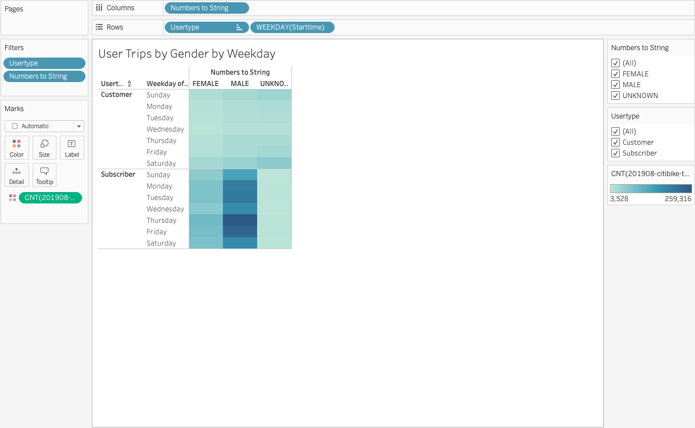

# NYC-Citi-Bikesharing
# Purpose 

Purpose: The purpose of the current analysis is to prepare visualizations that give potential investors a look into the highly-successful NYC Citibike bike-sharing program, so that they can see for themselves that a bike-sharing program in Des Moines is a solid business proposal. Among others, we have prepared visualizations that: 
1) Show the length of time that bikes are checked out for all riders and genders 
2) Show the number of bike trips for all riders and genders for each hour of each day of the week, and 
3) Show the number of bike trips for each type of user and gender for each day of the week

# Deliverable 1:  
## Change Trip Duration to a Datetime Format
 
### Results with detail analysis:

1. **The data in the "tripduration" column is converted to a datetime datatype and has the correct time format.**


> Image with `Jupyter Notebook` & `Tableau` Code below.

**Code and Image**


````py
# CHALLENGE 14
### MODULE 14 - Des Moines - Bike Sharing Project

import pandas as pd

# 1. Create a DataFrame for the 201908-citibike-tripdata data. 
citibike_df = pd.read_csv(citibike_data)

# 2. Check the datatypes of your columns. 
citibike_df.dtyoes

# 3. Convert the 'tripduration' column to datetime datatype.
citibike_df['tripduration'] = pd.to_datetime(citibike_df['tripduration'], unit='s')

# 4. Check the datatypes of your columns. 
citibike_df.dtypes
````
## Comparison and Analysis of change of datatypes 

(Figure 1) | (Figure 2)
:------------------------------------------:| :-------------------------------------:	
 | 
tripduration presents as an int64 data type.  | tripduration presents as a datetime data type.


2. **The DataFrame is exported as a new file without the index column.**

````py
# 5. Export the Dataframe as a new CSV file without the index.
citibike_df.to_csv("201908-citibike-tripdata_2.csv", index = False)

````

# Deliverable 2:  
## Create Visualizations for the Trip Analysis

### Create the Checkout Times for Users Viz
In this visualization, we graph the length of time that bikes are checked out for all riders.

<p align="center">
 
</p>

[Find the Live worksheet here!](https://public.tableau.com/app/profile/sannan.saleem/viz/CheckoutTimesforUsers_16601924380040/checkouttimesforusers)

### Create the Checkout Times by Gender Viz
In this visualization, we graph the length of time that bikes are checked out for each gender.

<p align="center">
 
</p>

[Find the Live worksheet here!](https://public.tableau.com/app/profile/sannan.saleem/viz/CheckoutTimesbyGender_16601925029830/checkouttimesbygender)


### Create the Trips by Weekday for Each Hour Viz
In this visualization, we graph the number of bike trips by weekday for each hour of the day as a heatmap:

<p align="center">
 
</p>

[Find the Live worksheet here!](https://public.tableau.com/app/profile/sannan.saleem/viz/TripsbyWeekdayPerHour_16601926844130/TripsbyWeekdayPerHour)


### Create the Trips by Gender (Weekday per Hour) Viz
In this visualization, we graph the number of bike trips by gender for each hour of each day of the week as a heatmap.

<p align="center">
 
</p>

[Find the Live worksheet here!](https://public.tableau.com/app/profile/sannan.saleem/viz/TripsbyGender_16601927371990/Tripsbygender)

### Create the User Trips by Gender by Weekday Viz
In this visualization, we graph the number of bike trips by gender for each hour for each day of the week as a heatmap.

<p align="center">
 
</p>

[Find the Live worksheet here!](https://public.tableau.com/app/profile/sannan.saleem/viz/UserTripsbyGenderbyWeekday_16601927880610/UserTripsbyGenderbyWeekday)

### Find the User Trips per hour 
In this visualization, we graph the number of bike trips per hour as a bar graph to find peak and off-peak hours that users may be using the service 

<p align="center">
 
</p>

[Find the Live worksheet here!](https://public.tableau.com/app/profile/sannan.saleem/viz/NumberofRidersPerHour/NumberofRidersperhour)

### Find the most popular start/stop stations
In this visualization, we chart the most popular start and end stations as serviced by users of the program 

(Figure 1) | (Figure 2)
:------------------------------------------:| :-------------------------------------:	
 | 
Most popular start stations.  | Most popular end stations.

[Find the Live worksheet for start stations here!](https://public.tableau.com/app/profile/sannan.saleem/viz/MostPopularStartStations_16601928481270/mostpop_startloc)

[Find the Live worksheet for start stations here!](https://public.tableau.com/app/profile/sannan.saleem/viz/MostPopularEndStations_16601930888630/mostpop_endloc)

# Deliverable 3: 
## Summary
 
### Results with detail analysis:
Deliverable 3 charts the worksheets previously created into ashtetically visualized dash boards answering our 3 initial questions:

1) Show the length of time that bikes are checked out for all riders and genders

[Find the Live dashboard here!](https://public.tableau.com/app/profile/sannan.saleem/viz/NYCCitiDashboard-CheckoutTimes/NYCCitiBikeDashboard-CheckoutTimes)

Using the interactive dashboard we are able to see that majority of users checkout their bikes for 5 minutes before we see an exponential decline in riership after that such so that our main ridership conists mostly of male riders at an approx 3:1 male to female ratio. were also bale to se at a glace that as of Aug. 2019 citibike had a ridership of 2.34M users 

2) Show the number of bike trips for all riders and genders for each hour of each day of the week, and 
3) Show the number of bike trips for each type of user and gender for each day of the week

The final 2 qestions can be answered using the following dashboard:

[Find the Live dashboard here!](https://public.tableau.com/app/profile/sannan.saleem/viz/NYCCitiDashboard-TripsTaken/NYCCitiBikeDashboard-NYCCitiBikeDashboard-TripsTaken)

where we can see that Male riders use the bike sharing service the heaviest where all users regardless of gender seem to exhibit that on avg the highest number of trips taken happened durong the weekdyas (Mon - Fri) at the hours of 7am-9am and 4pm-8pm which id be under the assumption that users are going to and from work. 

## Repair Program
Finally, in order to solidify the proposal, while one of the key stakeholders would like to see a bike trip analysis, which is completely understable to breakdown and alayse in orderr to be able to make an informed decision, i belive one must also take into account a repair program service for bikes currently in servce. As ridership cintinues to increase, I belive that this is a problem that will quickly expand nad cause an impact to user experience and so for that front using the lsat 3 visualisations presented in deliverable 2, the [story created here](https://public.tableau.com/app/profile/sannan.saleem/viz/NYCCitiStory-RepairProgram/NYCCitiStory-bikeRepairprogram?publish=yes) aims to shed light onto a bike repair program that can be implemented amoghst the bikes.
